# 台亞加油站 加油員手冊（新手培訓用）

## 🚗 基本觀念

### 加油槍位置與對應車位（收銀機按鍵 F1~F4）
| 按鍵 | 車位/槍別說明         |
|------|----------------------|
| F1   | 左前方車位           |
| F2   | 左後方車位           |
| F3   | 大槍柴油（靠近你這邊） |
| F4   | 小槍柴油（另一邊）     |
- 左前方客人的付款放F1插槽，左後方客人付款放F2插槽
- 用小槍加油時，小槍客人的付款（會員卡、信用卡、錢、名片）放在F4插槽，即使小槍客人的車在右前方。
- 用大槍加油時，大槍客人的付款放F3，即使大槍客人的車在右後方。

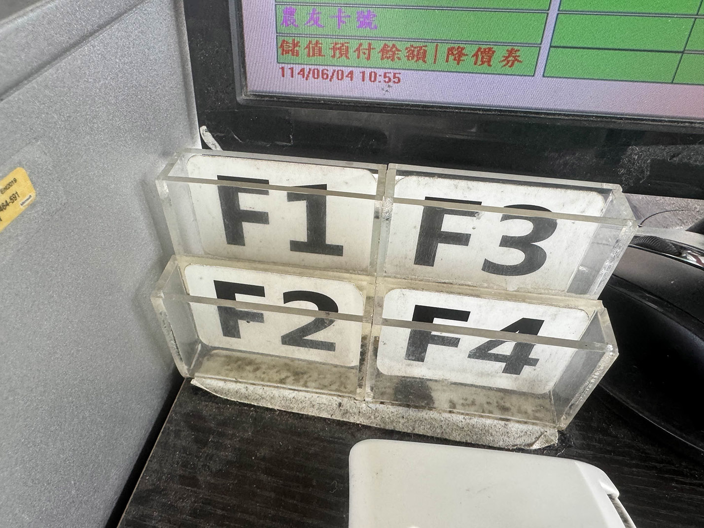

### 🚫 不可加錯油！
- **柴油油槍較粗**，**插不進汽油車油孔**，若插不進，請立即**停手並詢問客人是否是汽油車。**
- 柴油孔有**Diesel**英文字，或是「**柴油**」，看清楚再加。
- **小貨車常是汽油車**，容易誤開到柴油區，需特別注意！

### 加完油後，收槍之前
- 要先把油漏乾淨，花幾秒鐘將油槍內的油滴進客人的油箱。
- 若油槍內還有油，下個客人加油時油槍內的油會漏到地上。
- 油槍漏乾淨後，將油槍反著拿，收回加油機，讓油槍內幾滴油流回加油機。

### 機車、慢慢加油
- 幫機車加油時要手動慢慢加油，不能全速加油，否則油加滿時會漏出來。
- 加油時帶著布罩住加油孔周圍，看著機車的加油孔來加油，觀察是否滿溢。

### 柴油中貨車
- 中貨車要用小槍加柴油。
- 若中貨車的加油孔接的是油管而非油箱，全速加油時會漏出來，需要用布罩住加油孔，並以中等速度加柴油。

### 油箱門開啟方向
- 油箱門在後方時，是從車後側方向開油箱門；油箱門在前方時，兩種方向都有（從車後側方向開油箱門或車前側方向開油箱門）。

### 轎車大多為95、98，很少加92
- 加92的轎車大多為計程車(紅牌車)，若加92則要重複確認是否加92。加錯92則要加98來抵銷92的爆震並賠加油錢。
- 入門款摩托車大多加92，中重型機車才會加95以上。

---

## ⛽ 汽油車/機車加油操作流程

1. **詢問油品與加油方式**
   - 範例：95加滿 / 98一千 / 95 25公升 / 92跳槍 / 95跳停
2. **大聲喊出油品與數量給客人聽（雙重確認）**
3. **打開油箱蓋，再喊一次油品與數量**
4. **開始加油**
   - **汽車**可用擋片快速加油。
   - **機車**需手動慢慢加（每秒約2~4元），避免油溢出。
5. 詢問客人
   - 要刷卡還是付現
   - 有沒有會員(APP)
   - 需要統編嗎？(可拿計算機請客人打統編)
   - 需要載具嗎？
6. **加油跳停後詢問客人是否可接受跳停量**
7. **現金付款補整數規則**
   - 汽車最多補至下一個「整百元」。機車頂多補個 2~3 元，通常不補。
8. **加完油**
   - 收槍、關好油箱蓋（確認蓋緊！）
   - 確認加油機的小籃子上有沒有油箱蓋忘了拿回去鎖
9. **進行收銀操作**
   - 選擇 F1~F4 對應車位
   - 選擇付款方式：現金 / 信用卡 / 第三方支付
   - 若有 **會員 / 載具** → 按「**F6**」 → 拿掃碼機掃手機條碼 →「**F5**」確認
   - 按「**F12**」列印發票 / 信用卡單據
10. **完成交易**
   - 歸還：現金找零 or 信用卡、發票、簽名單等

鍵盤
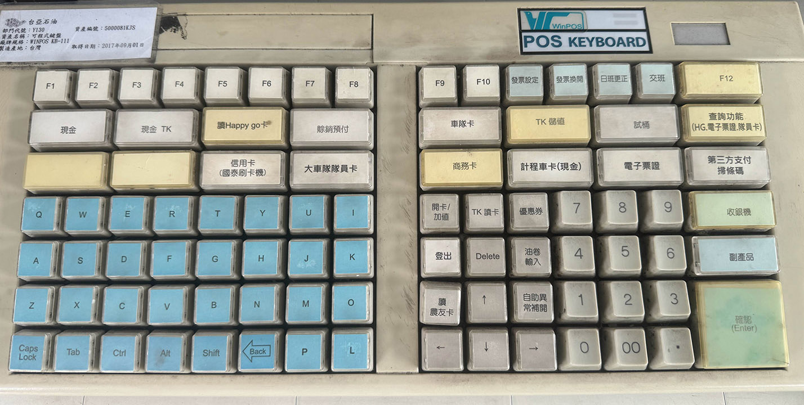

---
## 💳 付款方式與對應流程

### 1. 現金付款
- 無會員/統編/載具 → 按「**現金**」 → 按「**F12**」 印發票 → 找零 + 發票
    - 注意找零時不要找錯金額，換班後算錢時如果有缺少的錢要用自己的錢補上。
    - 即使客人不拿發票，付完錢加完油後就離開，也要出發票，讓現金、帳和油量能對上。避免對帳找錯誤時花太多時間。
### 2. 信用卡付款（無會員/統編/載具）/ Apple Pay
- 按「**信用卡(國泰刷卡機)**」
- 用無線刷卡機操作（支援感應/插卡/刷卡/手機感應）（刷磁條時，磁條朝刷卡機上方，方向從左到右或從右到左皆可）
- **F12** 印發票與信用卡帳單
- 某些信用卡需簽名（留意刷卡機提示）（超過三千元時必簽）
    - 注意不要還錯客人信用卡，卡片要放在正確的卡槽位置。
---
## 📱 第三方支付流程
### 台塑 Pay
1. 選擇「**第三方支付**」
2. 選擇「折扣」或「積點」
3. 按 「**F12**」
4. 掃描台塑 Pay 條碼
### Line Pay / 街口 / Pi錢包 等
1. 選擇「第三方支付」
2. 若有會員 → 「**F6**」 → 掃會員條碼 → 「**F5**」確認（若第三方支付有綁載具就不用單獨掃載具）
3. 選擇「折扣」或「積點」
4. 按 「**F12**」
5. 掃付款碼
---

## ⭐ 積點或折扣資格（需詢問）

| 類別       | 油品       |有效時段       |備註                |
|------------|-----------|--------------|------------------------------|
| 台塑聯名卡  | 汽油/柴油    | 每天       | 黑底彩色/灰底灰色卡，共2張      |
| TK會員卡    | 汽油        | 每天        | 現金TK  (等於 現金+台塑APP)    |
| 現金+台塑APP |  汽油      | 每天        | **F6**                        |
| 台塑 Pay      | 汽油/柴油  | 每天        | 第三方支付 (等同台塑聯名卡)      |
| TK會員卡      | 柴油        | 週五        | 現金TK                      |
| 現金+台塑APP   |  柴油       | 週五       | **F6**                        |
| OpenPoint     |   汽油     | 週六       | **F6** 滿 25 公升可用，和台塑APP二選一|
- 一般信用卡+APP：只能選折扣。
> ❌ 不用問：一般信用卡、其他支付工具、現金，沒搭配APP → 無積點/折扣

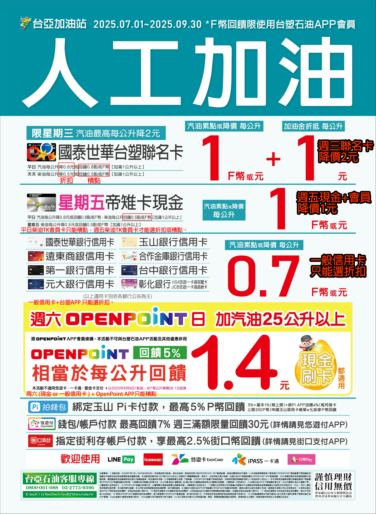

- 週三加油日，當要加的金額在25公升以上時，要加15元到要加金額內。
    - 例如：在週三時，客人說 95 1000，則加油機要按1015再幫客人加油。
    - 週三加油日使用會員卡或APP時，每公升可降價1元。平日每公升可降價0.8元。

- 備註：最優惠加油方式是在週三，使用聯名卡加25公升，並使用新安裝APP的25元折抵優惠券，則加25公升時，效果為每公升降價3.6元。(每公升降價分別為 聯名卡2元 + 折抵15元的0.6元 + 優惠券1元)

### 卡槽中的卡片面向表示客人要折扣還是積點
- 卡片正面面向加油員：積點
- 卡片背面面向加油員：折扣

### 折抵：將儲存的點數用於折抵付款金額
- 選擇付款類型後，按「**F6**」叫出視窗後，下方可選擇折抵類型：
1. 不折抵
2. 台塑點 (台塑聯名卡的點數)
3. HG點 (遠東集團的Happy Go點數)
4. 加油金
5. 加油金+台塑點 (刷台塑聯名卡時最常被要求折抵的選項)
6. 加油金+HG點
7. OP點 (7-11的Open Point點數)
8. F幣折抵 (台塑APP的點數)

---

## 🔄 TK卡片與賒銷/預付操作

### TK 系列卡片

| 卡別             | 按鍵     | 操作要點                                      |
|------------------|----------|----------------------------------------|
| TK會員卡 | 現金 TK        |有些需輸入統編或車號                           |
| 計程車卡 | 計程車卡(現金)  |同上                                          |
| 車隊卡| 車隊卡            | 車牌需與卡片相符，否則不得加油；需輸入里程數與油品|
| 商務卡| 商務卡            | 同上                                    |
| 大車車隊員卡|大車隊隊員卡 | 藍色卡，不用讀卡，直接按車位(F1~F4) → F12      |
| TK會員卡 | TK儲值        | 使用卡片內儲值的錢付帳，需先看錢是否足夠，會印單子但不用簽|
| 悠遊卡 | 電子支付        |  |

流程：卡插入讀卡機 → 「**TK讀卡**」 → 選對類型 → 「**F12**」 →（部分卡需簽名）

### 賒銷/預付客戶

| 預付公司 | 三興、台富、立仁、昶宏、原裕、溪塗、萬鎰、環球、鑫強|  
| 賒銷公司 | 成功物流、成功速配、十二藍物流、以樂物流、常盛物流  |  

- 操作：
  - 按「**賒銷預付**」→ 輸入車牌、里程數（依公司規定）→ F12 → 簽名
  - 若三興未付款無法印出簽單 → 請司機改付現金或刷卡

- 注意事項：客人換新車、卡片車號不符時，請輸入正確車牌號。（卡片上有統編和舊車號的情況）
- 簽單簽完後，三聯單最後一張拿給客人，拿回三聯單前兩張放進簽單櫃對應的抽屜內

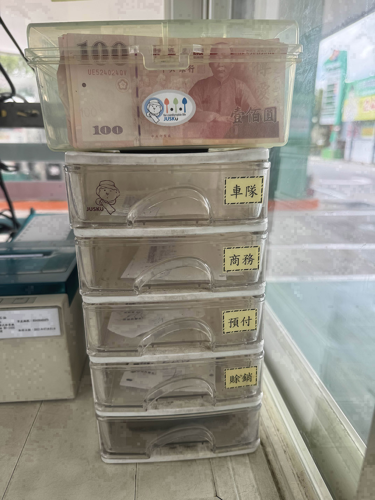
- 簽帳單
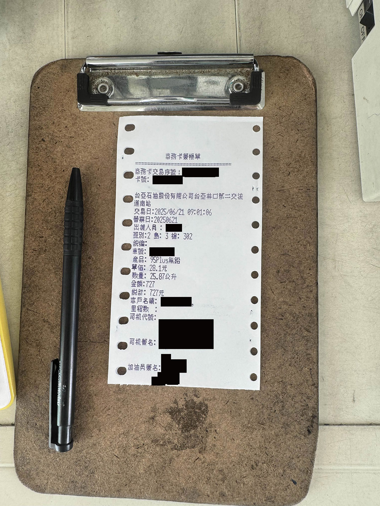

---

## 🧾 統編與載具注意事項

| 狀況                    | 處理方式                         |
|-------------------------|----------------------------------|
| 有統編                   | 不需問載具，直接輸入統編           |
| 無統編、有載具、有會員      | 按 F6 掃手機條碼 → 按 F5 確認       |
| 無統編、無載具、無會員      | 不需掃碼                         |

---

### 工作時注意喇叭聲
- 當客人要求加油時會按喇叭，需要注意喇叭聲去服務客人。（平常情況下喇叭聲太過頻繁，通常會去忽略喇叭聲。）
- 若沒注意到客人感受，有可能被客訴。
- 遇到客訴時，處理會很麻煩，流程是總公司→站長→領班→在場的加油員，這會牽涉到很多人，還要寫報告還原當時情況。
- 因此為了避免額外工作量，盡量別被客訴。

---

## 🎯 工作重點提醒

1. **最重要的是不要加錯油！**
2. 搞清楚交易類型與付款方式
3. 慢慢熟悉卡片與支付工具
4. 雙重確認油品與數量
5. 加油完確認油箱蓋
6. 注意是否需發票、簽名、找正確零錢、正確歸還信用卡、會員卡
7. 加完油後要開發票，讓現今、油品、帳目對得上。
8. 服務好客人盡量別被客訴。

---

**勇敢問資深同事，學習安全最重要！加油 💪**

---

## 🎁 換贈品流程

1. 按「**收銀機**」
2. 進入登入畫面
3. 帳號：身份證字號
4. 密碼需要用辦公室的電腦第一次登入改密碼後才能用。預設密碼不公開來保持資安。
5. 按「**F5 登入**」進入收銀機模式畫面
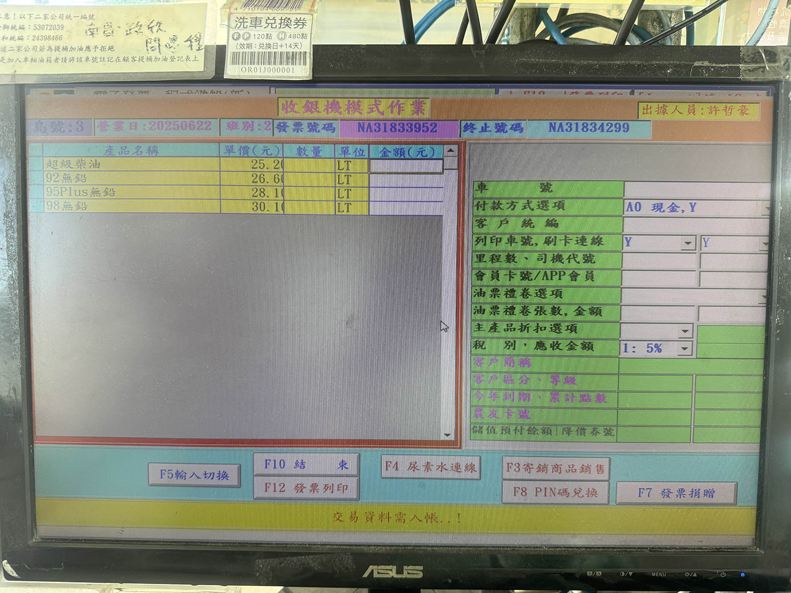
6. 按「**F3 寄銷商品銷售**」進入寄銷商品兌換頁面
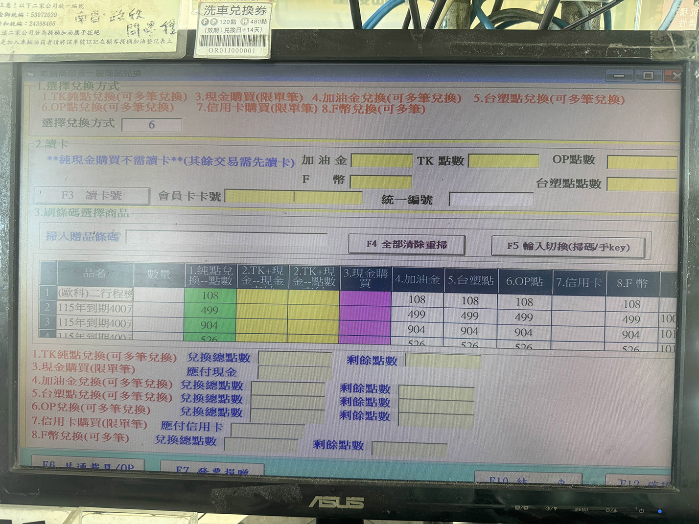
7. 選擇兌換方式

| 兌換方式                   | 後續動作                            |
|---------------------------|--------------------------------------|
| 6.OP點、8.F幣(台塑APP點數)   | 『掃碼機』掃客人手機的APP條碼          |
| 1.TK點數(TK會員卡)           | 按「**F3 讀卡號**」→ 『讀卡機』讀TK會員卡    |
| 4.加油金、5.台塑點(台塑聯名卡) | 按「**F3 讀卡號**」→ 『無線刷卡機』讀信用卡 |
| 3.現金購買、7.信用卡購買       | 一次只能買一項（同一項可以多個數量）                   |

8. 用『掃碼機』掃商品條碼
9. 修改兌換數量
10. 按「**F12 確認**」

---

## ⛽ 選擇油品輸入公升

- 「油槍」掛槍（放回加油機）後再拿起來，會導致價錢、公升消失，需要手動輸入。
- 統編、車號錯誤，交易撤銷，需要重開發票。

操作流程：

1. 按「**收銀機**」
2. 登入帳號密碼 → 按「**F5 登入**」
3. 選擇油品，例如95
4. 輸入價錢
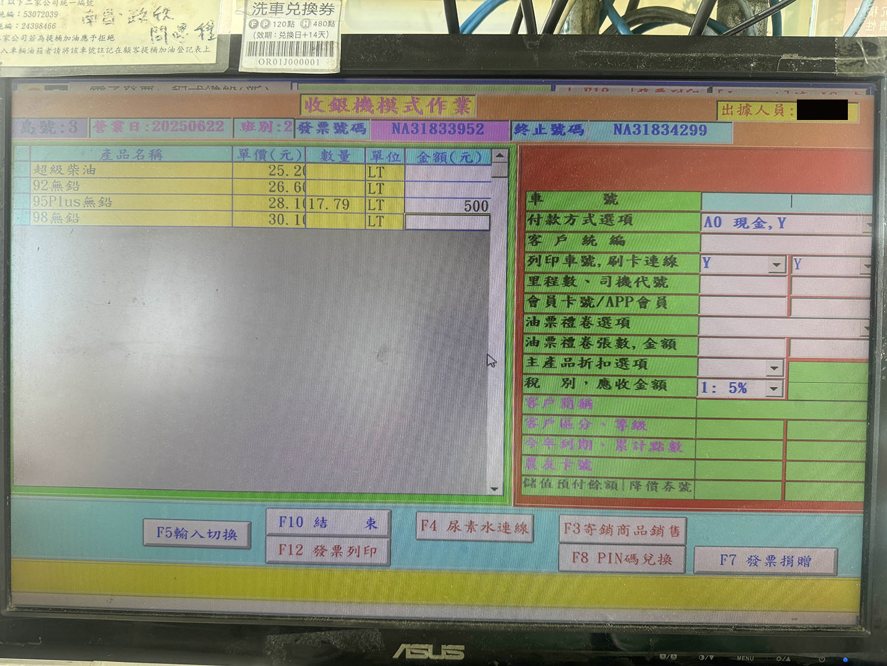
5. 按「**F5輸入切換**」焦點移到右視窗
6. 輸入正確的交易別（詳細步驟和一般交易方式一樣）
7. 按「**F12 發票列印**」，跳出確認公升畫面，輸入公升。
- 若要加兩次油，用收銀機開發票，要先記錄第一個公升和價錢，之後加第二次油，將兩個公升和價錢相加後再收銀機內開發票（油品要相同）。

---

## 🔄 刷退信用卡、換開發票

### 刷退信用卡，積點、折扣選錯時，重開發票

1. 按「**發票換開**」
2. 選擇要退的發票

- 不可以選錯

3. 選擇要退的支付方式
    - 「**F6**」刷卡交易取消
    - 「**F8**」第三方支付退刷

4. 進入收銀機模式，選擇油品輸入公升來重開發票

### 統編、車號打錯時，換開發票

1. 按「**發票換開**」
2. 選擇要換的發票
3. 按「**F5輸入切換**」焦點移到右視窗
4. 修改統編、車號
5. 按「**F12 列印發票**」
6. 抄新發票末2碼到舊發票上，例如：
   - NA31833945 → 舊
   - NA31833948 → 新
7. 將NA31833945最後兩位改成48，並寫換開原因，寫一個字：「統」、「車」、「折」、「積」。
 - 台塑pay無法在加油島上更換發票，需要在辦公室換。

> 不管按到什麼，「**F10**」永遠是取消、退出

### TK現金卡儲值

1. 「**開卡/加值**」
2. 「**F3 TK卡儲值**」
3. 輸入要儲值的金額，依情況打統編或按「**F5載具**」掃載具
4. 「**F12 確認儲值**」
5. 跳出視窗要再輸入一次儲值的金額，確定。
6. 按「**F10**」退出回到首頁，按「**TK讀卡**」確認下方儲值金額，告知客人餘額。

---

**換贈品到換開發票流程是正職加油員的職責，不是實習生的職責，需要累積更多信任並熟練加油後才能解鎖更高的權限（職務升級）。之後還有島主、領班等有更高級的權限，換班後要做對帳等工作。**
 - 在實習期間需要遵從島主的安排，除了把油加好之外，也要把交易、出帳做好。若熟練後，島主會開放實習生做更高權限的事，有的不行只能做實習生份內的工作。
 - 換現金時要先給島主看過收到的錢、要找的錢，避免找零失誤需要補錢。
 - 穿上制服看的時間（我不知要多久，做了一個月半，還沒穿上制服就離職了），並不是看是否會全部的工作內容。

---

## 🧮 折扣計算機

### 週三滿25公升折扣15元

1. 「**Ctrl + Z**」開啟 折扣計算機
2. 若是客人要加整數且有會員要折扣，例如「95一千」
3. 在折扣計算機的「95、會員」輸入1015，根據油價換算： (1015 ÷ 折扣後油價) × 油品售價。
   - 「95一千」要加的油：1045 (95油價為28.1，(1000+15)÷27.3×28.1=1044.7 四捨五入為1045)
4. 會員每公升折0.8元，計程車每公升折2元。

### 油價最快每週更新一次（週一凌晨一點更新），汽油折扣換算表會更新。
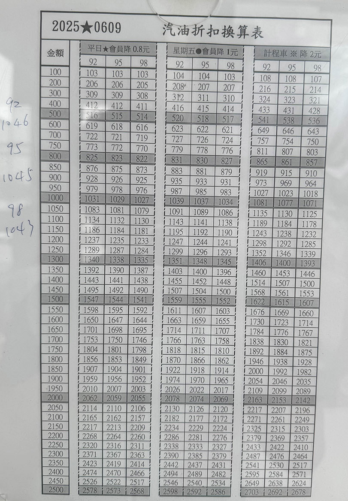

---
### 「**CTRL + P**」可印出空白的車隊卡簽單。

---

## 🚿 洗車流程

1. 在表格紙張上記錄車牌
2. 問客人有沒有會員（TK會員卡、聯名卡、台塑APP、OpenPoint），洗車會員價140元，非會員180元，計程車100元(計程車加油後有「40元洗車折抵券」)。
3. 再問要不要加洗鋼圈70元，或鍍膜100元。
4. 在表格紙張上記錄收費方式（洗車券、現金、刷卡）、交易內容（洗車、鋼圈、鍍膜）。
4. 按「**副產品**」進入副產品頁面
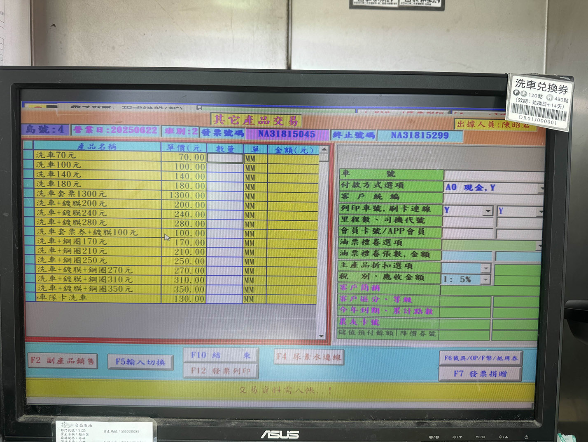
5. 選擇數量後，按交易類別（「**現金**」、「**信用卡**」，無法用第三方支付）
   - 會員價不需要刷卡、掃APP，只需在問客人時有確認到有TK會員卡、APP即可。
6. 「**F12發票列印**」，給客人發票。
7. 開始刷洗鋼圈（若有買洗鋼圈的話）。
8. 指揮汽車進入洗車間，按「**高壓泡沫**」開始洗車
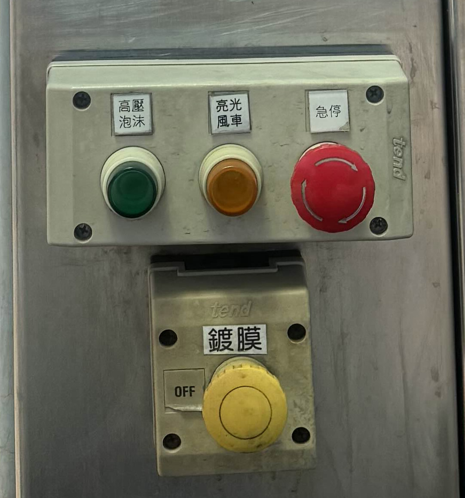
9. 用海綿快速刷洗車身，用水沖照後鏡
10. 按「**亮光風車**」/「**鍍膜**」開始吹乾。
11. 指揮汽車離開洗車間，擦乾汽車。

### 洗車券+鋼圈70元 + 鍍膜100元 ，要分開出發票，選「洗車套票+鍍膜100元」、「洗車70元」。

---

## 🧾 洗車券開通

1. 按「**副產品**」進入副產品頁面
2. 洗車套票1300元，一個
3. 「**F12 發票列印**」
4. 掃洗車套票上的條碼，共十個
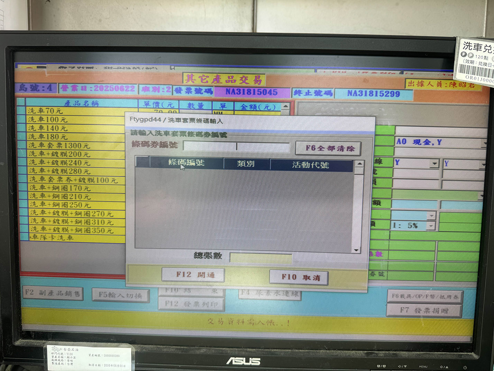
5. 「**F12 開通**」
6. 給客人洗車套票
  - 開通後的洗車套票才有效

---

## 🎟️ 洗車券折抵

- 除了洗車券之外，還有 洗車APP「洗金寶」內也有洗車券

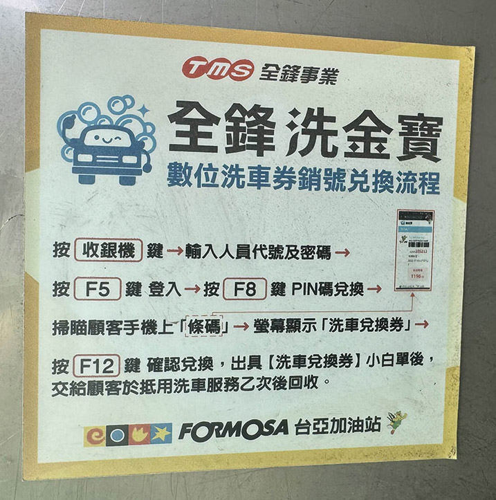
1. 按「**收銀機**」登入
2. 「**F8 PIN碼兌換**」
3. 掃洗車券條碼、洗金寶APP的碼
4. 按「**F12**」印出小白單

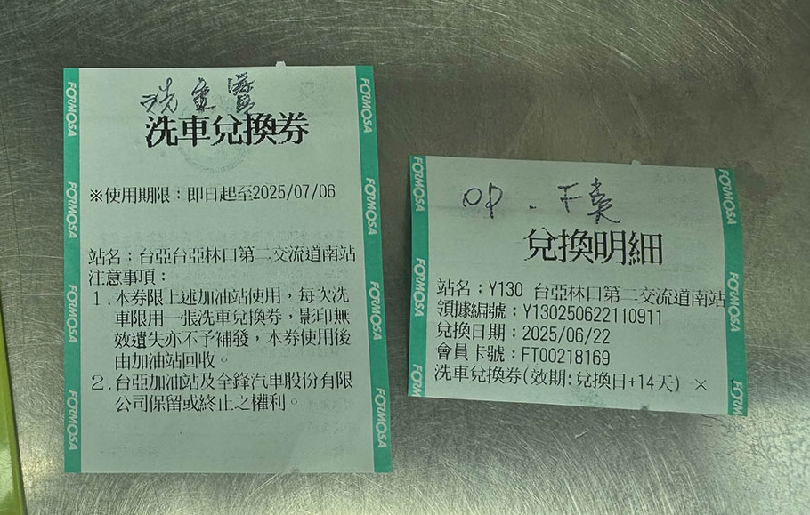

---
## 💰 點數兌換洗車券

- 需130點
- 流程與換贈品相同：

1. 按「**收銀機**」登入
2. 「**F3 寄銷商品銷售**」
3. 選擇兌換方式，掃客人的APP。
4. 掃螢幕上方的「洗車兌換券」

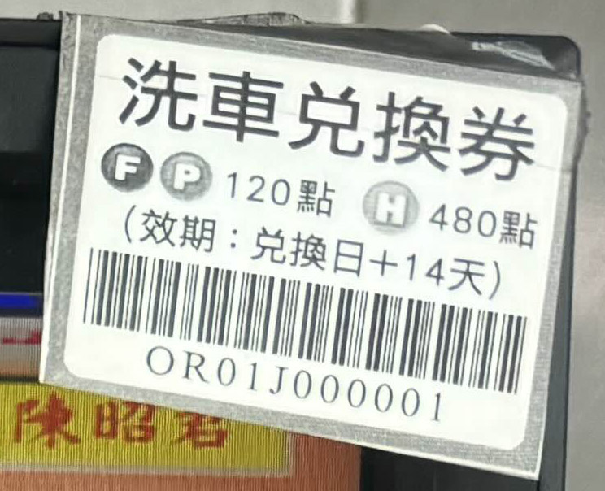

5. 按「**F12 確認**」
6. （可選）若不是馬上要洗車，要開通這張洗車券，需在14天內使用。
7. 在紀錄洗車的手寫板右方寫「APP點數兌換」。

## 🎯 工作重點提醒

1. **退換發票時不要選錯發票**

---

## 交班流程
### 交班時段為：6:50~7:00、14:50~15:00、22:50~23:00，在沒客人且下一班的領班來接班時交班。
### 有兩台設備需要交班：電腦、信用卡機，兩個可以同時進行沒有分誰先誰後。
### 電腦交班：
1. 按「**交班**」→按「**Enter**」確定
2. 按「**F5 交班**」→「**F5 列印至簽單**」（簽單機開始列印）→「**F12 交班完成**」（不用等簽單機印完直接按）
3. 「**登出**」登出電腦→按兩次「**↓**」下→按「**Enter**」登出電腦
4. 按「**Enter**」登入→按「**Enter**」輸入密碼（密碼為空）進入桌面
5. 按「**F12 確定**」確定程式使用新鍵盤
6. 輸入自己的帳號密碼→「**F5 登入**」→進入加油首頁。
### 信用卡機交班：
1. 「**選單**」
2. 「**結帳**」
3. 「**1. 連動結帳**」，等信用卡機印出刷卡紀錄。

---

## 當機卡住原因
### 有幾種情況會導致當機或卡住：
1. 「發票重號」，印出發票時會卡住幾分鐘，之後會跳出視窗說發票重號，問要不要換成下一個號碼，選否，登出再登入重新輸入油品另外結帳。（卡了這麼久，下一個發票號碼數字大概也被用了。）
2. 信用卡沒連線或沒回應。只能等待信用卡網路不繁忙的時候。
3. 按錯鍵的時候，輸入統編時，同時按到「**1**」和旁邊的「**自助異常補開**」，那程式會直接關閉閃退，只能登出重新登入。（輸入數字時慢慢按不要按錯鍵）。

